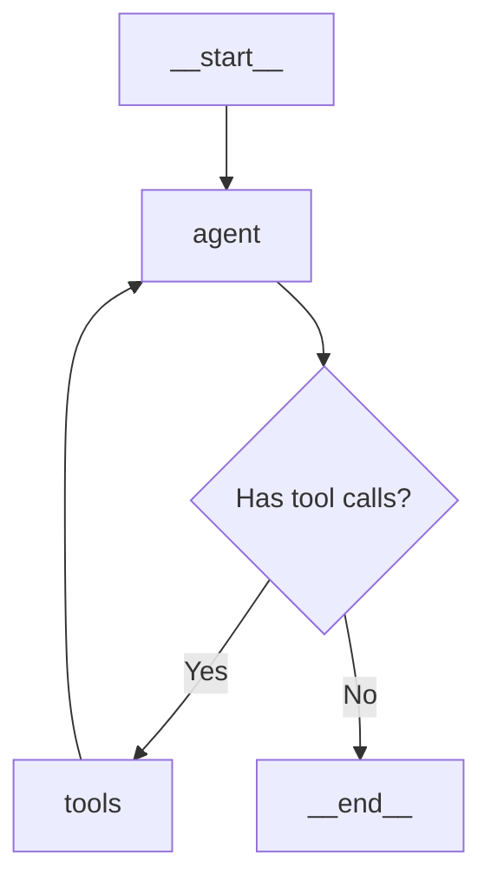

This example demonstrates how to create an autonomous agent using Composio tools with LangChain and LangGraph to build a stateful conversation flow.

## Overview

In this example, you'll learn how to:
- Integrate Composio with LangChain
- Build a state graph for agent workflows
- Create multi-turn conversations with context
- Use tools within a LangGraph workflow

## Prerequisites

<Steps>
  <Step title="Install dependencies">
    ```bash
    npm install @composio/core @composio/langchain @langchain/openai @langchain/core @langchain/langgraph
    ```
  </Step>

  <Step title="Set up environment variables">
    Create a `.env` file with your API keys:
    ```bash
    COMPOSIO_API_KEY=your_composio_api_key
    OPENAI_API_KEY=your_openai_api_key
    ```
  </Step>
</Steps>

## Complete Example

```typescript
import { ChatOpenAI } from '@langchain/openai';
import { HumanMessage, AIMessage } from '@langchain/core/messages';
import { ToolNode } from '@langchain/langgraph/prebuilt';
import { StateGraph, MessagesAnnotation } from '@langchain/langgraph';
import { Composio } from '@composio/core';
import { LangchainProvider } from '@composio/langchain';

// initiate composio
const composio = new Composio({
  apiKey: process.env.COMPOSIO_API_KEY,
  provider: new LangchainProvider(),
});

// fetch the tool
console.log(`🔄 Fetching the tool...`);
const tools = await composio.tools.get('default', 'HACKERNEWS_GET_USER');

// Define the tools for the agent to use
const toolNode = new ToolNode(tools);

// Create a model and give it access to the tools
const model = new ChatOpenAI({
  model: 'gpt-4o-mini',
  temperature: 0,
}).bindTools(tools);

// Define the function that determines whether to continue or not
function shouldContinue({ messages }: typeof MessagesAnnotation.State) {
  const lastMessage = messages[messages.length - 1] as AIMessage;

  // If the LLM makes a tool call, then we route to the "tools" node
  if (lastMessage.tool_calls?.length) {
    return 'tools';
  }
  // Otherwise, we stop (reply to the user) using the special "__end__" node
  return '__end__';
}

// Define the function that calls the model
async function callModel(state: typeof MessagesAnnotation.State) {
  console.log(`🔄 Calling the model...`);
  const response = await model.invoke(state.messages);

  // We return a list, because this will get added to the existing list
  return { messages: [response] };
}

// Define a new graph
const workflow = new StateGraph(MessagesAnnotation)
  .addNode('agent', callModel)
  .addEdge('__start__', 'agent') // __start__ is a special name for the entrypoint
  .addNode('tools', toolNode)
  .addEdge('tools', 'agent')
  .addConditionalEdges('agent', shouldContinue);

// Finally, we compile it into a LangChain Runnable.
const app = workflow.compile();

// Use the agent
const finalState = await app.invoke({
  messages: [new HumanMessage('Find the details of the user `pg` on HackerNews')],
});
console.log(`✅ Message recieved from the model`);
console.log(finalState.messages[finalState.messages.length - 1].content);

const nextState = await app.invoke({
  // Including the messages from the previous run gives the LLM context.
  // This way it knows we're asking about the weather in NY
  messages: [...finalState.messages, new HumanMessage('what about haxzie')],
});
console.log(`✅ Message recieved from the model`);
console.log(nextState.messages[nextState.messages.length - 1].content);
```

## How It Works

<Steps>
  <Step title="Initialize with LangChain Provider">
    We initialize Composio with the `LangchainProvider`, which automatically formats tools for LangChain compatibility.
  </Step>

  <Step title="Create Tool Node">
    We create a `ToolNode` from the Composio tools. This node will be responsible for executing tools in the graph.
  </Step>

  <Step title="Bind Tools to Model">
    We create a ChatOpenAI model and bind the tools to it using `.bindTools()`. This enables the model to call these tools.
  </Step>

  <Step title="Define State Graph">
    We create a `StateGraph` with two nodes:
    - `agent`: Calls the model to decide the next action
    - `tools`: Executes the tools when the model requests them
  </Step>

  <Step title="Add Conditional Edges">
    We add conditional routing logic:
    - If the model makes tool calls → route to `tools` node
    - Otherwise → end the workflow
  </Step>

  <Step title="Execute Workflow">
    We invoke the compiled workflow with messages. The graph automatically handles tool execution and maintains conversation state.
  </Step>
</Steps>

## Graph Visualization

The workflow graph looks like this:



## Expected Output

```bash
🔄 Fetching the tool...
🔄 Calling the model...
✅ Message recieved from the model
The user 'pg' on HackerNews is Paul Graham, co-founder of Y Combinator. He has:
- User ID: pg
- Karma: 155,000+
- Account created: February 2007
- Bio: Founder of Y Combinator...

🔄 Calling the model...
✅ Message recieved from the model
The user 'haxzie' on HackerNews has:
- User ID: haxzie
- Karma: 1,234
- Account created: ...
```

## Key Features

<AccordionGroup>
  <Accordion title="Stateful Conversations">
    LangGraph maintains conversation state across multiple turns. The second query about "haxzie" uses context from the previous conversation.
  </Accordion>

  <Accordion title="Automatic Tool Routing">
    The graph automatically decides when to use tools based on the model's output, creating an autonomous agent workflow.
  </Accordion>

  <Accordion title="Composable Workflows">
    You can extend this graph with additional nodes for more complex workflows like error handling, validation, or multi-step reasoning.
  </Accordion>
</AccordionGroup>

## Advanced Usage

You can extend this example with:

- **Streaming**: Add streaming support for real-time responses
- **Checkpointing**: Save and restore conversation state
- **Multiple Tools**: Add more Composio tools for richer capabilities
- **Custom Nodes**: Add validation or preprocessing nodes

## Next Steps

<CardGroup cols={2}>
  <Card title="Custom Tools" icon="wrench" href="/examples/typescript/custom-tools">
    Create your own tools with custom logic
  </Card>
  <Card title="OpenAI Example" icon="brain" href="/examples/typescript/openai-basic">
    Learn the basics with OpenAI
  </Card>
</CardGroup>
